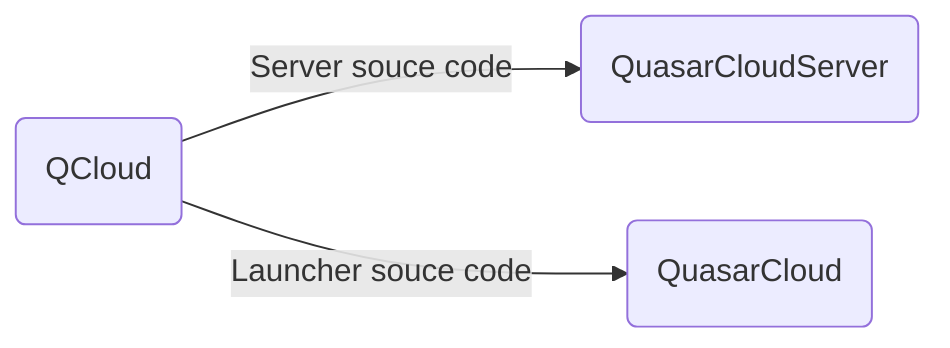

# QCloud
****
## Проект по удалённому доступу к ПК

## Сервер

### Актуальная версия: 4.1.0.4

## Клиент

### Актуальная версия: 4.0.9

### Road Map
- [ ] Переход на новый протокол общения с сервером
- [ ] Система автоматического устранения проблем
- [ ] Переустановка системы
- [ ] Система обновления нативных приложений
- [ ] Детализация ошибок
- [ ] Новый способ аутентификации клиента
> Новый интерфейс
 >- переработка интерфейса пользовательского соглашения (программно и графически)
>- сообщение об отсутствии подключения к сети
- [x] Добавлена система языковых пакетов (пока только Русский)
- [x] Глобальная перестройка JavaFX
- [x] Добавлено сепарирование Операционных систем
- [x] Новый протокол общения с сервером
- [x] Нативные приложения под каждую платформу
- [x] Обновлены зависимости

## Карта проекта

