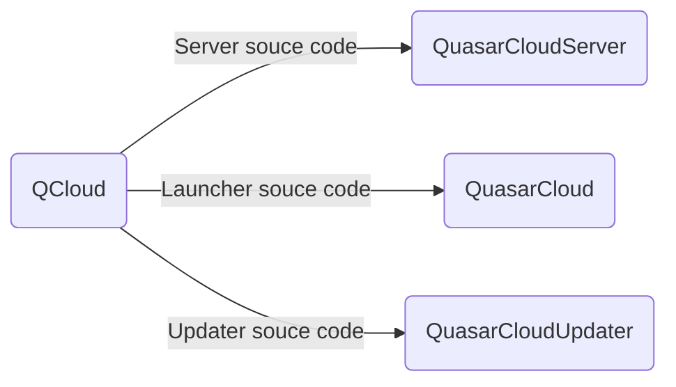

# QCloud
****
## Проект по удалённому доступу к ПК

### Road Map
- [ ] Система автоматического устранения проблем
- [ ] Переустановка системы
>Система обновления нативных приложений
>- Установщик обновлений выделен в отдельное приложение
- [x] Переход на новый протокол общения с сервером
- [x] Детализация ошибок
- [x] Новый способ аутентификации клиента
  - Два ключа шифрования
  - Ключ регистрации более не храниться на машине
  - Ключ авторизации не может быть использован для подключения к машине новых аккаунтов
- [x] Новый интерфейс
- [x] Добавлена система языковых пакетов (пока только Русский)
- [x] Глобальная перестройка JavaFX
- [x] Добавлено сепарирование Операционных систем
- [x] Нативные приложения под каждую платформу
- [x] Обновлены зависимости

## Карта проекта

