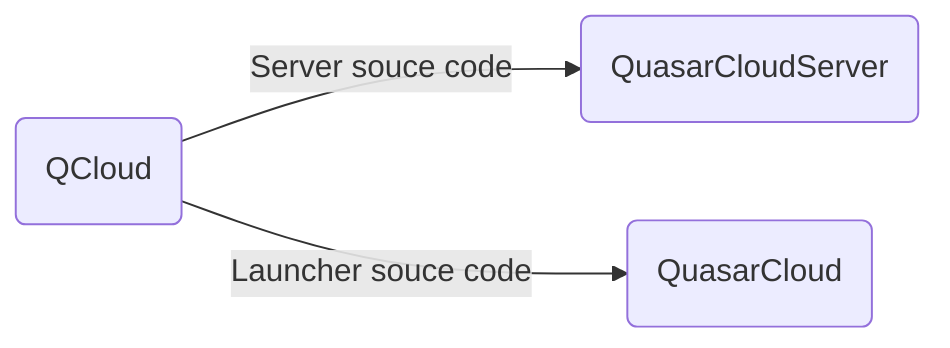

# QCloud
****
## Проект по удалённому доступу к ПК

## Сервер

### Актуальная версия: 4.1.0.4

## Клиент

### Актуальная версия: 4.0.9

### Что нового?
- ^ Новый способ аутентификации клиента
- | Глобальная перестройка JavaFX
- | Добавлено сепарирование Операционных систем
- | Новый протокол общения с сервером
- | Нативные приложения под каждую платформу
- | Обновлены зависимости

## Карта проекта

